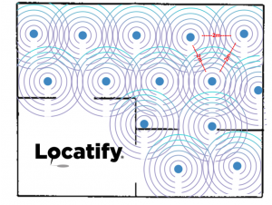
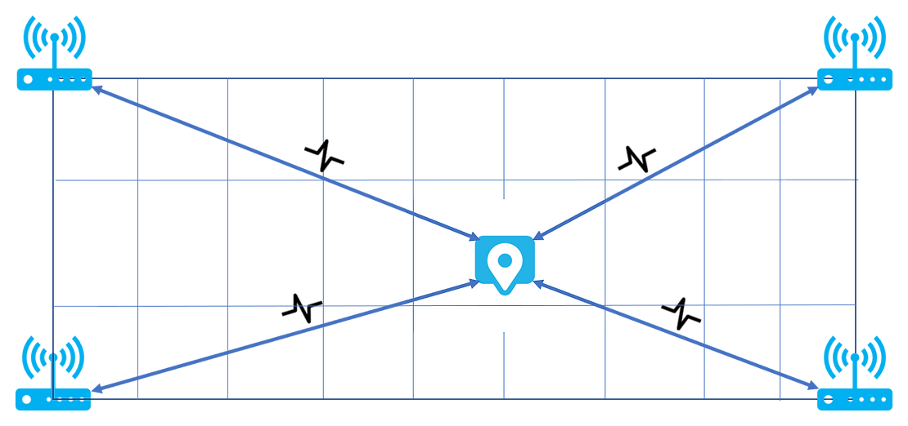
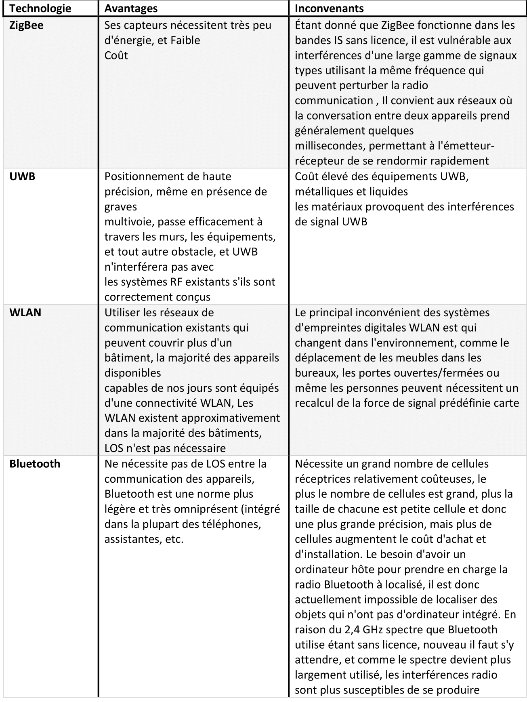
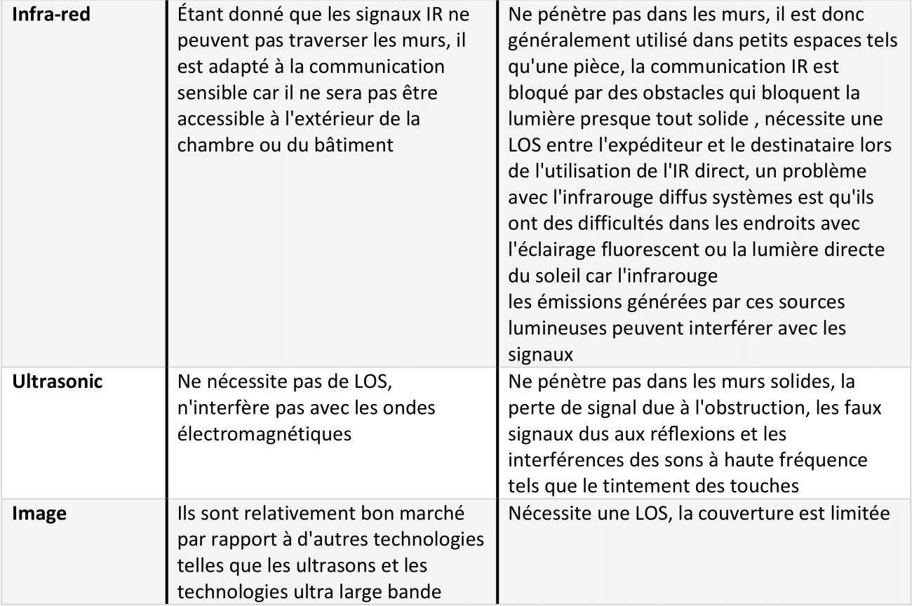
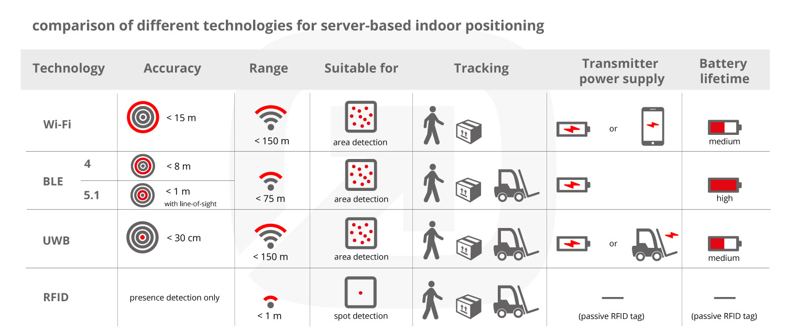

# Auteur : 

* SALMI badr-eddine

# Sujet :

* Quelle est la meilleure technologie GeoIndoor ,

----
### Table 
- Qu'est-ce qu'un système de positionnement intérieur (IPS) ?
- les technologie possible pour GeoIndoor :
    -   BLE
    -   WIFI
    -   UWB
    -   RFID
    -   IR
    -   LI-FI
    -   Ultra-sound
    -   ZigBee

- Comparaison entre ces Technologies
- Choix final 

# Système de positionnement intérieur :

Un système de positionnement intérieur (IPS) peut être considéré comme un GPS pour les sites intérieurs. En utilisant une variété de méthodes, ces systèmes peuvent détecter des emplacements en temps réel pour déterminer les coordonnées des personnes ou des biens à l'intérieur d'un bâtiment. Ces coordonnées sont généralement représentées visuellement par un point bleu sur une carte intérieure numérique pour fournir un contexte supplémentaire aux utilisateurs et des fonctionnalités telles que l'orientation.

# Les technologie possible pour GeoIndoor :

## Bluetooth Low Energy:
        
Les signaux Bluetooth Low Energy (BLE) des balises alimentées par batterie sont au cœur de la technologie de localisation intérieure. C'est l'une des technologies les plus importantes qui a émergé pour le positionnement en intérieur et qui est devenue la norme de l'industrie disponible sur la plupart des appareils aujourd'hui. Il utilise des balises dites BLE (ou iBeacons) qui sont peu coûteuses, petites, ont une longue durée de vie de la batterie et ne nécessitent pas de source d'énergie externe. L'appareil (téléphone/montre, etc.) détecte le signal de la balise et peut calculer approximativement la distance jusqu'à la balise, estimant ainsi l'emplacement intérieur de l'utilisateur.

Pour afficher l'emplacement de l'utilisateur, nous utilisons un algorithme de trilatération qui exige que l'utilisateur soit à moins de 6 mètres d'au moins 3 balises à tout moment. Les performances de cette méthode dépendent largement de la qualité de la configuration de votre balise et de l'appareil de l'utilisateur.

Pour de meilleurs résultats, placez les balises dans une formation de grille avec des balises espacées de 2 m comme indiqué ci-dessous, ou si cela n'est pas possible, d'une manière qui couvre les zones les plus pertinentes avec un nombre minimum de balises.

<table>
<tr>
<td>

</td>
<td>

</td>
</tr>
</table>

---
## WIFI

Il existe des balises émettrices WiFi dans ce système qui envoient de simples paquets d'informations aux points d'accès WiFi dans un espace intérieur. Le système dorsal utilise un algorithme pour étudier l'heure et la force de ces lectures reçues afin de déterminer la position des balises émettrices.
Ces informations de localisation sont enregistrées dans le cloud et vous sont transmises sur le tableau de bord frontal. Le système utilise une mesure de différence de temps d'arrivée (TDOA) avec une large bande passante pour fournir une précision de position d'environ trois à cinq mètres.

---

## Ultra-Wideband (UWB):

Le système de positionnement intérieur UWB est apparu il y a plus de 20 ans, mais ce n'est que récemment qu'il s'est étendu aux entreprises qui ont besoin d'un outil sans fil standardisé et unifié pour connecter le matériel informatique. En utilisant le système UWB, certaines tâches vraiment importantes peuvent être résolues, notamment:

 * une protection fiable des données 
 
 * prise en charge de la transmission de données à haut débit 
 * localisation d'objets 
 * réduction de la consommation d'énergie.

La technologie Ultra Wide-band a du potentiel. Grâce à une précision de positionnement élevée, allant de 10 à 30 cm, la technologie Ultra Wide-Band est largement utilisée pour contrôler le périmètre des endroits dangereux de l'entreprise et contrôler la mise en œuvre des KPI sur les lieux de travail.

UWB est une technologie à bande ultra large utilisée pour transmettre des impulsions à haute fréquence à de petites distances. Les signaux UWB sont transmis à des fréquences allant jusqu'à quelques GHz et atteignent la bande passante de 25% à 100%.

Les ordinateurs et périphériques nécessitent une interface haut débit mais l'utilisation du Bluetooth et de la norme 802.11 ne permet pas toujours d'atteindre les objectifs fixés. Le principal inconvénient de ces protocoles est une faible bande passante (en moyenne - jusqu'à 19 Mbits/sec), ce qui est irrationnel pour les applications qui nécessitent des débits de transmission élevés.

Lors de la mise en œuvre du suivi de localisation UWB dans l'infrastructure de l'entreprise, chaque actif suivi est équipé d'une étiquette spéciale avec un accumulateur intégré ou attaché. Dans son travail, l'étiquette prend des milliards d'impulsions radio qui sont émises à un intervalle d'une nanoseconde dans une large gamme de fréquences. Des récepteurs, ou transpondeurs, détectent ces signaux et les transforment en informations permettant de définir la position de l'objet.

---

 ## Radio-frequency-identification : 

Un système RFID – RFID signifie « radio-frequency-identification » – comprend deux composants : un transpondeur (ou étiquette) contenant des données qui peuvent être lues par RF et un interrogateur (ou lecteur) qui peut lire les données du transpondeur.

Les moyens spécifiques par lesquels ces composants communiquent (c'est-à-dire leur "mécanisme de couplage") déterminent la portée, la complexité et le coût du système. (« Couplage » dans ce contexte fait référence à un transfert d'énergie entre l'étiquette et le lecteur.) Actuellement, trois types de mécanismes de couplage sont en concurrence sur le marché : inductif, capacitif et rétrodiffusé.

---

##  IR system :

Les systèmes de localisation intérieure basés sur l'infrarouge utilisent des impulsions lumineuses infrarouges (comme une télécommande de télévision) pour localiser les signaux à l'intérieur d'un bâtiment. Des récepteurs IR sont installés dans chaque pièce, et lorsque l'étiquette IR émet des impulsions, elle est lue par le récepteur IR.

---

## LIFI :
Li-Fi signifie Light-Fidelity, qui fait référence à la « communication par la lumière visible (VLC) » utilisant des diodes électroluminescentes
(LED) comme support de transmission de données sans fil. L'idée de base de la technologie Li-Fi est d'utiliser la lumière visible
d'une ampoule LED pour transmettre des données à haut débit à un photodétecteur, qui est connecté à un smartphone ou
tablette. Le photodétecteur convertit le signal d'éclairage reçu en signal électrique, qu'un smartphone ou une tablette
peut reconnaître et procéder facilement. En fait, le Wi-Fi et le Li-Fi sont des ondes électromagnétiques : la fréquence du Wi-Fi
Le spectre est d'environ 2,4 GHz ou 5 GHz, tandis que le spectre de fréquences du Li-Fi est situé dans la bande de lumière visible. Considérant
l'utilisation généralisée des blubs LED à l'intérieur des bâtiments et une large bande passante de lumière visible, la technologie Li-Fi est beaucoup
moins cher et plus écologique que le Wi-Fi. La technique Li-Fi a un grand potentiel dans de nombreux
applications, telles que les services basés sur la localisation, la connectivité mobile, l'éclairage intelligent et les environnements dangereux.

---
## Ultra-sound :
Cette technologie repose sur l'utilisation d'ultrasons qui définissent le spectre des ondes sonores avec une fréquence trop élevée pour la perception humaine (plus de 20 kHz). Le système de localisation par ultrasons est basé sur le mode de transmission du signal ascendant/descendant, de sorte que lors de l'installation, le nombre d'appareils récepteurs n'est pas limité. Le positionnement par ultrasons est considéré comme une solution plus efficace par rapport au GPS car, lors du positionnement, il ne nécessite pas de visibilité directe entre les émetteurs et les lecteurs de signaux.

---
## ZigBee :

ZigBee est une nouvelle norme ouverte à adopter dans la conception et la mise en œuvre de réseaux de capteurs sans fil. Avec un tas de fonctionnalités sur les faibles émissions radio, la faible consommation d'énergie, la longue durée de veille, la courte distance, le réseau activé, la grande quantité de nœuds, la topologie flexible et la facilité de former un réseau, ZigBee devient rapidement l'une des technologies grand public pour le numérique sans fil. vie intelligente. Cette image en dessous présente la pile de protocoles de ZigBee et les interfaces d'application pour la mise en œuvre du suivi de localisation par ZigBee. En outre, le schéma de suivi de localisation est expliqué et un système de suivi de localisation pilote est conçu et démontré. Le résultat a montré qu'un nœud observé peut être correctement positionné selon les performances attendues

<table>
<tr>
<td>

</td>
<td>

</td>
</tr>
</table>

---

## Avantages et Inconveniants de chaque technologie :

( LOS : loss of signal )

---

## Comparaison entre les technologies :

<table>
<tr>
<td>

</td>
<td>

</td>
</tr>
</table>

---

## Conclusion : 

Ce n'ai pas facile a choisir une tell technologie pour GeoIndoor , il y a plusieurs contraintes (key attribute of a successful indoor wireless positioning system : cost , scalable , low-power , accurate and fast) qui demandent plusieurs études pour choisir la bonne technologie. Prenons l'exemple d'un hopital en 3D (plan complexe : plusieurs etages) on doit choisir Bluetooth Low Energy au lieu de Ultra-Wideband pour les raisons suivants :
* Long Battery Life : 
    comme on voit dans l'image precedante la technogie basé sur BLE consome moins d'energie que tous les autres technologie ,elle permet aux entreprises de suivre les actifs sans changer de batterie pendant 5 ans maximum par contre UWB ils auraient constamment besoin de changer les piles dans des centaines, voire des milliers d'étiquettes de suivi des actifs.

* Low Cost : Bluetooth LE dispose d'une infrastructure commerciale plus efficace que UWB. Un système Bluetooth LE ne prend que 5 minutes à configurer, ce qui lui permet d'être mis en œuvre à moindre coût et aide les utilisateurs à obtenir un retour sur investissement plus rapide. Les batteries plus durables contribuent également à réduire les coûts, car les entreprises n'auront pas à les acheter et à les changer constamment. Des systèmes plus complexes, comme UWB, peuvent augmenter considérablement les coûts de l'entreprise en devant acheter des batteries plus fréquemment. Une autre augmentation des coûts provient du besoin de plus de dispositifs de transmission que Bluetooth LE, car les actifs balisés utilisant UWB ont besoin d'une ligne de vue dégagée pour fonctionner correctement. Les coûts des balises sont également très différents les balises UWB standard en faibles volumes peuvent coûter jusqu'à 70 dollars par balise, tandis que les balises Bluetooth LE peuvent aller de 10 à 15 dollars par balise. Étant donné que les balises sont l'un des principaux coûts d'un système de suivi des actifs, la réduction du coût des balises peut réduire les coûts de plus de 80%.

* Accuracy : BLE permet aux entreprises de suivre les actifs en fonction des besoins spécifiques de localisation des actifs. En plaçant des balises Bluetooth LE dans une installation intérieure, les entreprises peuvent suivre les actifs dans une zone spécifique ou identifier plus précisément l'emplacement en ajoutant plus de balises. Contrairement à UWB, il n'y a pas besoin d'un chemin clair entre les balises et les balises pour communiquer l'emplacement les uns avec les autres. Plus de balises permettent une meilleure précision, mais le nombre d'utilisations dépend de vos besoins spécifiques. UWB a une plus grande précision, mais si votre cas d'utilisation peut fonctionner avec une précision au niveau du mètre au lieu d'une précision au niveau du pied, Bluetooth LE est la voie pour vous

        "Bluetooth évolue d'une solution de smartphone et de réseau personnel vers une technologie de réseau sans fil évolutive et à faible consommation." (Recherche ABI). 
        "Ce développement débloquera la croissance des balises, de la domotique, de l'automatisation des bâtiments, de l'éclairage et d'autres applications de ville intelligente au cours de la prochaine décennie et au-delà."

C'est précisément pour cette raison que tout le monde se penche sur le BLE lors de la conception de ses solutions. Une architecture intelligente et bien pensée le rendait vraiment parfait pour les cas d'utilisation auxquels il était destiné. D'autre part, en raison du nom bien établi de Bluetooth Classic, BLE a eu plus de facilité à gagner la confiance des développeurs. Tous ces facteurs combinés en ont fait le choix incontournable pour de nombreuses applications IoT grand public et bien plus encore, renforçant encore sa position sur le marché. Et le Bluetooth SIG n'a pas encore dit son dernier mot - Bluetooth Low Energy est constamment développé et perfectionné pour répondre aux demandes les plus actuelles du marché, il devrait donc certainement rester sur votre radar.

---

## Sources :   

https://www.cloudForce.cn

https://www.ncbi.nlm.nih.gov

https://www.semanticscholar.org

https://www.researchgate.net

https://situm.com

https://eloquentarduino.com

https://www.mappedin.com